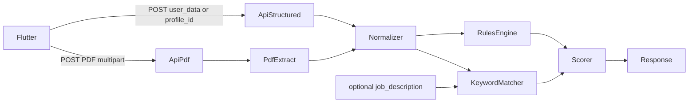

# ATS Checker (Rule-Based)

## Scope

- **In-app CV**: score `user_data` / existing `Profile` via structured rules
- **Optional JD**: keyword extraction + coverage / fit score when `job_description` is sent
- **Uploaded PDF**: extract text, run parseability + content rules (+ same optional JD match)
- **No AI/LLM**

Primary client is Flutter → public API next to existing CV print/create routes in [`routes/api.php`](routes/api.php).

## Architecture



| Piece | Responsibility |
|---|---|
| `AtsCheckerService` | Orchestrate input → normalized text/sections → score |
| `AtsRulesEngine` | Weighted pass/fail checks (completeness, contact, quality, format) |
| `AtsKeywordMatcher` | Tokenize JD, match against CV text, coverage % |
| `PdfTextExtractor` | PDF → plain text via `smalot/pdfparser` |
| `AtsCheckController` | Thin HTTP layer |

Reuse [`CVDataMapper`](app/Services/CVDataMapper.php) to normalize profile/`user_data` into one internal shape before scoring.

## API

Both public (same auth pattern as `POST /cvs` / `POST /cvs/print`):

**1. Structured check** — `POST /api/v1/cvs/ats-check`

```json
{
  "profile_id": 123,
  "user_data": { "...": "optional if profile_id" },
  "job_description": "optional string",
  "language": "en"
}
```

Resolve: `profile_id` → load Profile → map; or score inline `user_data`.

**2. PDF upload check** — `POST /api/v1/cvs/ats-check/upload`

- multipart: `file` (pdf, max ~5MB), optional `job_description`, optional `language`
- Extract text; if empty/near-empty → hard fail “not parseable” (likely scanned/image PDF)

**Response (shared shape)**

```json
{
  "score": 78,
  "grade": "B",
  "source": "structured|pdf",
  "categories": {
    "completeness": 90,
    "contact": 100,
    "content": 70,
    "ats_format": 80,
    "keyword_fit": 65
  },
  "checks": [
    {
      "id": "has_email",
      "category": "contact",
      "passed": true,
      "weight": 8,
      "message": "Email found",
      "tip": null
    }
  ],
  "keywords": {
    "matched": ["flutter", "dart"],
    "missing": ["ci/cd"],
    "coverage_percent": 65
  }
}
```

`keywords` / `keyword_fit` only when JD is provided. Score = weighted sum of checks (0–100); JD fit is a separate weighted category blended into overall when present (e.g. 70% structural + 30% keyword).

## Rule set (v1)

**Completeness:** name, job title, summary (≥N chars), ≥1 experience, ≥1 education, ≥3 skills, dates present on roles.

**Contact:** email format, phone present, location/address optional soft check.

**Content:** experience bullets/length, action-verb heuristic (EN list + light AR/TR stubs or language-agnostic length), avoid first-person pronouns (EN), summary not empty fluff-only.

**ATS format (structured):** prefer known section keys; flag photo-only reliance only as tip when template `supports_image` / photo set (soft).

**ATS format (PDF-only):** text extractable; email/phone regex in raw text; common section headings detected (`Experience`, `Education`, `Skills`, Arabic equivalents); warn if text length too low for page count / file size (scan heuristic); warn on very high special-character density.

**Keyword fit:** normalize JD (lowercase, strip stopwords, keep multi-word tech tokens), match against concatenated CV text; report matched/missing top terms + coverage %.

Config weights/thresholds in [`config/ats.php`](config/ats.php) so Flutter copy and scoring stay tunable without code churn.

## Files to add/change

- `composer require smalot/pdfparser`
- [`config/ats.php`](config/ats.php) — weights, min lengths, stopwords, action verbs
- `app/Services/Ats/AtsCheckerService.php`
- `app/Services/Ats/AtsRulesEngine.php`
- `app/Services/Ats/AtsKeywordMatcher.php`
- `app/Services/Ats/PdfTextExtractor.php`
- `app/Http/Controllers/Api/AtsCheckController.php`
- `app/Http/Requests/Api/AtsCheckRequest.php`
- `app/Http/Requests/Api/AtsCheckUploadRequest.php`
- [`routes/api.php`](routes/api.php) — two routes under public CV group
- Lang strings in `lang/*/messages.php` (or dedicated `ats.php`) for check messages/tips
- Tests: `tests/Feature/AtsCheckTest.php` + fixture PDF with selectable text; unit tests for keyword matcher / rules with sample `user_data`

No DB migration in v1 (stateless). No Filament UI in v1. No DOCX (PDF only as requested).

## Scoring formula

- Each check: `{id, category, passed, weight}`
- Category score = earned_weight / max_weight × 100
- Base score = sum(passed weights) / sum(all weights) × 100
- With JD: `overall = round(0.7 * base + 0.3 * keyword_coverage)`
- Grade bands: A ≥85, B ≥70, C ≥55, D ≥40, F &lt;40

## Out of scope

- LLM rewrite / suggestions beyond static tips
- DOCX/DOC upload
- Persisting scores on `profiles`
- Changing PDF templates or Flutter UI (API contract only; Flutter consumes later)
