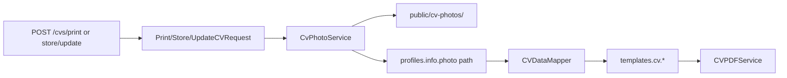

# New Templates + CV Photo API

## Current state
- **CVs:** 3 blades (`modern-professional`, `office-manager`, `ats-classic`) — no portrait photo.
- **Cover letters:** 2 blades (`ats-classic`, `professional`).
- **Convention:** DB `name` = view slug → `templates.cv.{name}` / `templates.cover-letter.{name}`.
- **Print:** JSON `POST /api/v1/cvs/print` via [`PrintCVRequest`](app/Http/Requests/Api/PrintCVRequest.php); no photo field. Profile photo lives nowhere today.

## Design roster

### 7 new CV templates (`supports_image: true`)

| Slug | Idea | Visual style |
|------|------|----------------|
| `portrait-modern` | Photo as hero circle top-right | Cool teal accent, Inter-like sans, airy header, single column below |
| `sidebar-slate` | Photo tops a dark left rail | Slate `#1e293b` sidebar (contact/skills/languages), white main column |
| `metro-grid` | Large photo left of name block | Magazine 2-col grid, charcoal + copper accent, bold section rules |
| `midnight-banner` | Photo inset in full-bleed dark header | Near-black banner, white type, gold hairline, body in calm gray |
| `coral-split` | Photo right of a split header | Warm coral `#e07a5f` left panel + cream content; rounded photo |
| `forest-folio` | Photo in earth-toned sidebar | Deep green `#2d4a3e` rail, serif headings, soft cream paper feel |
| `ink-editorial` | Small formal photo beside masthead | Black/white editorial, Didot-style display name, thin hairlines, justified body |

All 7 wrap `<x-template-layout>`, read `$cv['user_data']`, and render photo only when `$userData['photo']` is present:

```blade
@if(!empty($userData['photo']))
  
@endif
```

Existing 3 CVs stay text-only (`supports_image: false`).

### 8 new cover letter templates (no photo)

| Slug | Idea | Visual style |
|------|------|----------------|
| `serif-formal` | Traditional letterhead | Playfair/Merriweather, centered name, double-rule under header |
| `stripe-modern` | Vertical brand stripe | 12mm left color bar (`#0f766e`), clean sans body |
| `editorial-masthead` | Newspaper-style top | Oversized name + thin columns meta, gray subject line |
| `mono-tech` | Developer letter | Monospace, left-aligned meta stack, minimal borders |
| `dual-tone` | Two-tone header band | Navy top / soft blue bottom band, white name |
| `elegant-rules` | Quiet luxury | Wide margins, hairline rules, small-caps section labels |
| `banner-bold` | Full-width name banner | Solid charcoal header block, high contrast contact row |
| `compact-exec` | Dense executive letterhead | Tight spacing, right-aligned date, corporate blue `#1e3a5f` |

All wrap `<x-cover-letter-layout>` and reuse the same `$coverLetter['user_data']` fields as [`professional.blade.php`](resources/views/templates/cover-letter/professional.blade.php).



## API: send + save image

**Chosen format:** base64 (or data-URI) in JSON `user_data.photo`, matching the existing JSON print/CRUD APIs. Also accept an already-public URL/path for re-print without re-upload.

### Schema / model
1. Migration `add_supports_image_to_templates_table` — boolean `supports_image` default `false`.
2. [`Template`](app/Models/Template.php): add to `$fillable` + cast.
3. Filament [`TemplateForm`](app/Filament/Resources/Templates/Schemas/TemplateForm.php): checkbox for `supports_image`.
4. [`ShareController::templates`](app/Http/Controllers/Api/ShareController.php): include `supports_image` in the list payload.

### Persist photo on Profile
- Store file under `storage/app/public/cv-photos/{uuid}.jpg|png|webp`.
- Persist relative path in `profiles.info['photo']` (JSON — no new column).
- New small service e.g. [`app/Services/CvPhotoService.php`](app/Services/CvPhotoService.php):
  - Detect data-URI / raw base64 vs URL.
  - Validate mime (jpeg/png/webp), max ~2MB decoded.
  - Write to disk; return storage path.
  - `urlFor()` → public URL for Blade/PDF (Browsershot needs a reachable URL).

### Request / mapper / controllers
- Add to [`PrintCVRequest`](app/Http/Requests/Api/PrintCVRequest.php), [`StoreCVRequest`](app/Http/Requests/Api/StoreCVRequest.php), [`UpdateCVRequest`](app/Http/Requests/Api/UpdateCVRequest.php):
  - `user_data.photo` → `sometimes|nullable|string` + custom after-validation (base64 size/mime or valid URL).
- [`CVDataMapper`](app/Services/CVDataMapper.php): map `photo` into/out of `info`; when formatting for views/API, resolve path → public URL.
- [`CVController`](app/Http/Controllers/Api/CVController.php) store/update/print: before map/save, if `user_data.photo` is base64, run `CvPhotoService` and replace with stored path.
- Optional soft check: if template `supports_image` is false, still accept photo for storage but blades that don’t render it simply ignore it (no hard reject — keeps clients simple).

### Seeders
- [`TemplateSeeder`](database/seeders/TemplateSeeder.php): add the 7 new rows with `supports_image => true` (placeholder SVG/PNG preview paths or simple generated placeholders).
- [`CoverLetterTemplateSeeder`](database/seeders/CoverLetterTemplateSeeder.php): add the 8 new rows.

## Implementation order
1. Migration + model + Filament + ShareController `supports_image`.
2. `CvPhotoService` + request rules + mapper + controller wiring (print/store/update).
3. Build 7 CV blades (image-aware) + seed.
4. Build 8 cover-letter blades + seed.
5. Smoke via local `/test/cv/{slug}` and `/test/cover-letter/{slug}`.

## Out of scope
- Multipart-only upload endpoint (JSON base64 covers print + CRUD).
- Changing the 3 existing CV templates to show photos.
- Auto-generating real preview screenshots (seed placeholder paths; admin can replace via Filament).
