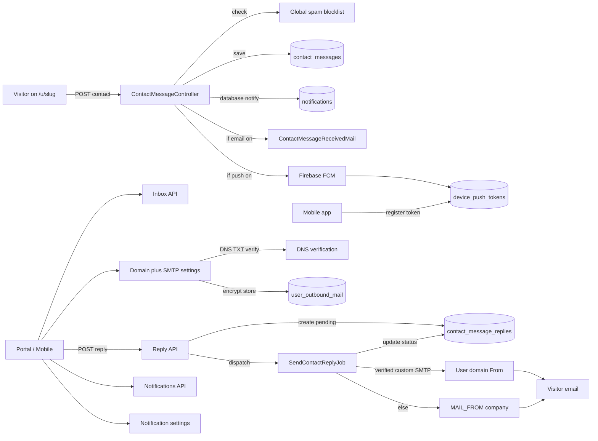

# Public profile contact, spam, notifications & social links

## Current state

Much of the messaging stack already exists and does not need reinventing:

- DB: `enable_contact_form`, `contact_form_recipient`, `contact_messages`, `social_links` JSON
- Public POST `/u/{slug}/contact` with honeypot + per-IP/email rate limit + queued [`ContactMessageReceivedMail`](app/Mail/ContactMessageReceivedMail.php)
- Shared partial [`_contact_form.blade.php`](resources/views/components/public-profile/_contact_form.blade.php) included by all 10 templates (generic look)
- Nuxt [`inbox.vue`](frontend/app/pages/portal/inbox.vue) already calls `/public-profiles/inbox` — **API routes missing**
- Nuxt editor does **not** expose contact toggles or social links; API update request does not accept `enable_contact_form`
- **No** Laravel `notifications` table, no FCM/Firebase packages, no device-token storage (greenfield)



## 1. Spam: platform-wide blocklist

**Approach:** if a sender is marked spam against one profile, they cannot contact *any* profile.

New table `contact_spam_blocklist`:

- `email` (normalized lowercase, indexed, nullable)
- `ip_address` (nullable, indexed)
- `reason` (`reported` | `honeypot` | `cross_profile` | `manual`)
- `source_message_id`, `reported_by_user_id` (nullable)
- Match on email **or** IP

**Enforcement** in [`ContactMessageController`](app/Http/Controllers/Public/ContactMessageController.php) (before create):

1. If email or IP is on the blocklist → fake success (same as honeypot)
2. Keep existing honeypot + `throttle:5,1` + RateLimiter 3/5min
3. **Auto-block:** honeypot hit → add email+IP; same email/IP contacting **3+ distinct profiles within 1 hour** → blocklist (`cross_profile`)
4. **Owner report:** inbox “Report spam” → hide message + insert email+IP (`reported`)

Optional Filament list for ops to unblock.

## 2. Inbox API + report action

Sanctum routes in [`routes/api.php`](routes/api.php):

- `GET /api/v1/public-profiles/inbox` — paginated messages for the auth user’s profile (include nested `replies` with delivery status)
- `POST /api/v1/public-profiles/inbox/{id}/read` — mark read
- `POST /api/v1/public-profiles/inbox/{id}/spam` — report + block globally

Mirror legacy [`Portal\PublicProfileController`](app/Http/Controllers/Portal/PublicProfileController.php) into `Api\PublicProfileInboxController`. Update [`inbox.vue`](frontend/app/pages/portal/inbox.vue) with Report spam.

## 2b. Owner replies (queued, delivery status)

Replace `mailto:` with in-app reply. Submit returns immediately; a queue worker sends mail under load.

**From identity (resolved in the job):**

1. If the owner has a **verified** custom domain + SMTP (see §2c) → send **From** `from_name` / `from_email` via their SMTP
2. Else → send **From** company `config('mail.from')` (`MAIL_FROM_ADDRESS` / `MAIL_FROM_NAME`), **Reply-To** `contact_form_recipient` or owner email

**Table** `contact_message_replies`:

| Column | Purpose |
|--------|---------|
| `contact_message_id` | Parent inbox message |
| `user_id` | Profile owner who replied |
| `body` | Reply text |
| `from_email` / `from_name` | Snapshot of From used at send time |
| `mail_mode` | `company` \| `custom_smtp` |
| `delivery_status` | `pending` → `queued` → `sent` \| `failed` |
| `provider_message_id` | Optional SMTP/provider id when available |
| `error_message` | Nullable failure reason |
| `queued_at` / `sent_at` / `failed_at` | Timestamps for each stage |

**Flow:**

1. `POST /api/v1/public-profiles/inbox/{id}/reply` with `{ body }` (validate length, ownership, not spam-hidden)
2. Create reply row with `delivery_status = pending`
3. Dispatch `SendContactReplyJob` (`ShouldQueue`); set status to `queued` when job starts
4. Job builds `ContactMessageReplyMail` using resolved From (§ above); **To** visitor email; subject `Re: {original subject}`; body quotes original
5. On success → `sent` + `sent_at`; on exception → `failed` + `error_message`; support Retry
6. API returns reply immediately so UI shows “Sending…” then refresh status

**Portal UI** ([`inbox.vue`](frontend/app/pages/portal/inbox.vue)):

- Reply composer; thread with status chips Queued / Sent / Failed
- Show which From was used (`mail_mode` + from name)
- Failed: error + Retry
- Banner if custom SMTP not set: “Replies send from {app}. Link your domain to reply as yourself.”

**Ops:** queue worker required (`php artisan queue:work` / `composer dev`).

**Mobile:** same reply endpoint; document in mobile API reference.

## 2c. Custom domain DNS + SMTP (reply as yourself)

Optional per-user outbound mail so replies use **their name and domain**.

**Table** `user_outbound_mail` (one row per user for v1):

| Field | Notes |
|-------|--------|
| `domain` | e.g. `acme.com` |
| `from_email` | Must be on that domain |
| `from_name` | Display name on replies |
| `dns_verification_token` | Random token shown in UI |
| `dns_verified_at` | Set when TXT check passes |
| `smtp_host` / `smtp_port` / `smtp_encryption` | `tls` / `ssl` / `null` |
| `smtp_username` | |
| `smtp_password` | **Encrypted** via `Crypt` (never returned in API; write-only / masked) |
| `smtp_verified_at` | Set after successful test send |
| `is_active` | User can pause custom sending without deleting |

**DNS ownership:**

- UI shows: add TXT record at `_cv-mail.{domain}` (or `@`) with value `cv-verify={token}`
- `POST /api/v1/settings/outbound-mail/verify-dns` — Laravel looks up TXT; on match sets `dns_verified_at`
- Also show SPF/DKIM guidance copy (user’s mail provider typically owns DKIM; we document that SPF should allow their SMTP host) — optional soft checks, not hard blockers beyond ownership TXT

**SMTP:**

- Settings form: host, port, encryption, username, password, from name/email, domain
- `POST /api/v1/settings/outbound-mail/test` — only if DNS verified; builds a one-off Symfony/Laravel mailer with their credentials; sends test to the user’s account email; on success sets `smtp_verified_at`
- Custom From allowed for replies only when `dns_verified_at` **and** `smtp_verified_at` and `is_active`

**UI:** Settings → **Sending email** tab (next to Notifications): domain steps, DNS instructions, SMTP fields, Verify DNS / Test send buttons, status badges (Unverified / DNS OK / Ready).

**Security:**

- Encrypt SMTP password at rest; never log it
- Rate-limit verify/test endpoints
- From email domain must equal verified `domain`
- If custom send fails in the job, mark reply `failed` (do not silently fall back mid-send without recording — optional auto-fallback to company can be a setting later; v1 fails with clear error so user fixes SMTP)

**API:**

- `GET/PUT /api/v1/settings/outbound-mail`
- `POST .../verify-dns`
- `POST .../test`

## 3. Profile URLs: `/u/{slug}` + optional vanity subdomain

Keep the default path URL and add an optional subdomain on the **app’s main domain**.

| Mode | Example | Default |
|------|---------|---------|
| Path (always) | `https://cv.test/u/sara` | Always works when profile is public |
| Subdomain (opt-in) | `https://sara.cv.test/` | When `enable_subdomain` is true |

**Data:**

- Existing unique `slug` (editable in portal)
- New bool `enable_subdomain` (default `false`) on `public_profiles`
- Config: `config('app.profile_domain')` or derive from `APP_URL` host (e.g. `cv.test` / production apex)
- Reserved labels: `www`, `api`, `app`, `admin`, `mail`, `ftp`, `cdn`, `static`, `portal`, `mcp`, etc. — reject as slug when subdomain enabled (and preferably as slug always)

**Resolution:**

- Middleware / early route: if request host is `{label}.{profile_domain}` and label is not reserved → `findPublicBySlug(label)` and render the same template as `/u/{slug}` (root `/` on subdomain)
- Apex + path `/u/{slug}` unchanged
- Contact POST: work on both hosts (named route or host-aware URL generation)
- [`PublicProfile::public_url`](app/Models/PublicProfile.php): prefer subdomain URL when `enable_subdomain`; also expose `path_url` / `subdomain_url` in API for the editor copy buttons
- Canonical SEO tag: prefer the user’s preferred public URL (subdomain if enabled, else path)

**Infra notes:**

- Laragon nginx already has `server_name cv.test *.cv.test` in [`scripts/laragon/cv.test.conf`](scripts/laragon/cv.test.conf) — ensure subdomain requests hit Laravel (same as `/u/`)
- Production: wildcard DNS `*.example.com` + TLS (document in README; not automated in app)

**Not in this slice:** fully custom apex domains (user’s own `www.acme.com`) — only subdomains of *our* main domain. Custom domains for *email* SMTP remain in §2c.

## 3b. Portal editor: contact, slug, subdomain, SEO

**File:** [`public-profile.vue`](frontend/app/pages/portal/public-profile.vue)

**Contact:**

- Toggle `enable_contact_form`
- Optional `contact_form_recipient`

**URL:**

- Editable `slug` (unique validation)
- Toggle `enable_subdomain` with live preview of both URLs
- Copy buttons for path and subdomain links

**SEO** (persisted in existing `seo` JSON / `user_data.seo`):

| Field | Use |
|-------|-----|
| `meta_title` | `<title>` + `og:title` |
| `meta_description` | meta description + `og:description` |
| `og_image` | `og:image` (URL or upload path if already supported) |
| `robots` | optional `index,follow` / `noindex` |

Expand [`public-profile-layout.blade.php`](resources/views/components/public-profile-layout.blade.php) to emit full OG tags + `canonical` to preferred public URL. Validate SEO keys on update request.

**API:** extend store/update to accept `enable_contact_form`, `contact_form_recipient`, `slug`, `enable_subdomain`, `user_data.seo.*`.

## 3c. Notification preference settings

**User notification prefs** (Settings → Notifications tab):

| Pref | Default | Effect |
|------|---------|--------|
| `notify_contact_email` | `true` | Send [`ContactMessageReceivedMail`](app/Mail/ContactMessageReceivedMail.php) |
| `notify_contact_push` | `true` | Send FCM push to registered devices |
| In-app center | always | Always write a database notification (not toggleable; center is the source of truth) |

- Migration on `users` for the two booleans
- API: `GET/PUT /api/v1/settings/notifications` (or fields on auth/me)
- Wire [`SettingsTabs.vue`](frontend/app/components/portal/SettingsTabs.vue) + notifications panel

## 4. In-app notification center

Greenfield Laravel notifications + portal UI (mobile shares the same REST).

**Backend:**

- `php artisan notifications:table` migration — standard `notifications` morph table
- `ContactMessageReceived` notification implementing `toArray` / `toDatabase` with payload: `{ type: "contact_message", message_id, name, subject, preview, profile_slug }`
- After `ContactMessage::create`, `$owner->notify(new ContactMessageReceived(...))` (always, for the center)
- Sanctum API:
  - `GET /api/v1/notifications` — paginated, newest first; include `unread_count`
  - `POST /api/v1/notifications/{id}/read`
  - `POST /api/v1/notifications/read-all`
- Extend [`PortalStatsService`](app/Services/Portal/PortalStatsService.php) with `unread_notifications` (in addition to existing `unread_messages`)

**Portal UI:**

- Bell in [`portal.vue`](frontend/app/layouts/portal.vue) layout with unread badge
- Dropdown/drawer listing recent notifications; click opens inbox message or deep-links to `/portal/inbox`
- Optional dedicated `/portal/notifications` page if the drawer needs “see all”

Inbox (contact messages) stays the full message body; the notification center is the activity feed + badge.

## 5. Firebase FCM for mobile

No Firebase stack today — add end-to-end server support; mobile clients call register APIs with their FCM token.

**Infrastructure:**

- Composer: `kreait/laravel-firebase` (or `laravel-notification-channels/fcm` + Kreait)
- Env: `FIREBASE_CREDENTIALS` path to service-account JSON (document in `.env.example`; do not commit the JSON)
- Config under [`config/services.php`](config/services.php) / package config

**Device tokens table** `device_push_tokens`:

- `user_id`, `token` (unique), `platform` (`ios` | `android`), `app_version` nullable, `last_used_at`, timestamps
- On register: upsert by token; reassign `user_id` if token moves between accounts

**API (Sanctum):**

- `POST /api/v1/devices/push-token` — `{ token, platform, app_version? }`
- `DELETE /api/v1/devices/push-token` — `{ token }` (logout / disable)

**Delivery:**

- Custom notification channel or `ContactMessageReceived::toFcm` / queued `SendFcmPushJob`
- On contact message: if owner `notify_contact_push`, fan-out to all of their tokens
- Drop invalid tokens on FCM `UNREGISTERED` / `INVALID_ARGUMENT` responses
- Payload: title/body + data keys (`type`, `message_id`, `deep_link`: `cv://inbox/{id}`) for mobile navigation

**Docs:** update [`docs/mobile/api-reference.md`](docs/mobile/api-reference.md), [`workflows.md`](docs/mobile/workflows.md), and Postman collection with token register + notifications list/read. Mobile app FCM SDK wiring stays client-side; this plan delivers the backend contract.

## 6. Social links (editor + data shape)

Normalize `social_links` to:

```json
[{ "platform": "instagram", "url": "https://...", "label": "optional for custom" }]
```

Platforms: `linkedin`, `github`, `x`, `instagram`, `youtube`, `facebook`, `tiktok`, `snapchat`, `calendly`, `behance`, `dribbble`, `medium`, `whatsapp`, `telegram`, `website`, `custom`.

- Mapper normalizes legacy keyed map and `{label,url}` on read/write
- Nuxt repeater: platform select + URL + optional custom label
- Validation: URL required; `custom` requires `label`

## 7. Per-template contact + social UI

**Shared pieces:**

- `_contact_fields.blade.php` — fields/honeypot/POST only
- `_social_links.blade.php` — SVG icon set; `$variant` (`row` | `stack` | `pills` | `mono`); CSS variables from parent

**Per template** (all 10 under [`resources/views/templates/public-profile/`](resources/views/templates/public-profile/)):

- Place social icons to match layout (header / sidebar / footer)
- Style contact section to match template look
- Gate contact by `enable_contact_form`

Update [`TemplatePreviewSample`](app/Support/TemplatePreviewSample.php) with sample social links.

## 8. Tests

- Contact submit → message + database notification; email when `notify_contact_email`; FCM job when `notify_contact_push`
- Blocked email/IP cannot message any profile; report spam blocks globally
- Inbox list/read/spam API ownership
- Reply: pending row + job; company From by default; custom SMTP From when dns+smtp verified
- DNS verify / SMTP test endpoints; password never in JSON
- Subdomain host resolves public profile; reserved subdomain rejected; `/u/{slug}` still works when subdomain enabled
- SEO fields round-trip and appear in rendered HTML (title, description, og, canonical)
- Notifications list/read/read-all
- Push-token register/unregister
- social_links normalize in public profile response

## Out of scope

- Visitor-initiated follow-up emails back into the thread (visitor uses their mail client)
- User apex custom domains for the *profile site* (e.g. `www.acme.com` → profile) — only `{slug}.{our-domain}` plus `/u/{slug}`
- Provider-managed DKIM key generation hosted by us
- Changing CV/cover-letter templates
- Native iOS/Android Firebase SDK (backend + API + docs only)
- Web Push / browser FCM for Nuxt
