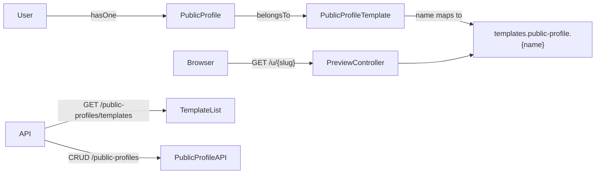

# Public Profile Templates

## Architecture

Mirror the existing Cover Letter pattern (separate model + templates + Blade views), not the CV `templates` table.



- **One public profile per user** (`user_id` unique)
- **Public URL:** `GET /u/{slug}` (e.g. `/u/jane-doe`) — only when `is_public = true`
- **Template selection:** `public_profile_template_id` on the profile; override via `?template_id=` on preview for testing

## Suggested data model (backend)

### `public_profile_templates`
| Column | Notes |
|--------|--------|
| `name` | kebab-case slug matching Blade filename |
| `preview` | path e.g. `images/public-profile-templates/{name}.png` |
| `description` | short marketing copy |
| `is_active` / `is_default` | same flags as cover-letter templates |

### `public_profiles`
| Column | Purpose |
|--------|---------|
| `user_id` | unique FK |
| `public_profile_template_id` | FK, nullable |
| `slug` | unique, URL segment |
| `is_public` | gate for `/u/{slug}` |
| `language` | en/ar/tr (match CV) |
| `headline` | short tagline under name |
| `about` | longer bio (richer than CV summary) |
| `info` JSON | identity + contact (see below) |
| `social_links` JSON | twitter, linkedin, github, dribbble, youtube, custom |
| `experiences` JSON | work history (reuse CV shape) |
| `educations` JSON | education |
| `projects` JSON | portfolio items + `technologies`, `url`, `image`, `featured` |
| `skills` JSON | name + optional `level` / `category` |
| `languages` JSON | name + proficiency |
| `services` JSON | what they offer (title, description, icon/emoji key) |
| `testimonials` JSON | quote, author, role, company, avatar |
| `certifications` JSON | name, issuer, date, credential_url |
| `achievements` JSON | title, description, year |
| `availability` JSON | `status` (open/available/not), `message`, `rate` optional |
| `cta` JSON | primary button label + url (hire me / contact) |
| `sections_order` JSON | which blocks show and order |
| `seo` JSON | `meta_title`, `meta_description`, `og_image` |

### `info` JSON shape (suggested)
```
firstName, lastName, jobTitle, email, phone, address, city, country,
photo, coverImage, website, birthdate, pronouns
```

This is intentionally richer than CV `Profile.info` so the public page can feel like a portfolio site, not a printed resume.

## 10 template styles (completely different)

All under [`resources/views/templates/public-profile/`](resources/views/templates/public-profile/) with shared layout [`resources/views/components/public-profile-layout.blade.php`](resources/views/components/public-profile-layout.blade.php).

| # | `name` | Visual direction |
|---|--------|------------------|
| 1 | `minimal-folio` | White space, thin type, single column, almost no color |
| 2 | `dark-terminal` | Near-black bg, monospace, green accent, “developer” feel |
| 3 | `editorial-serif` | Large serif headlines, magazine grid, cream paper texture |
| 4 | `bold-poster` | Huge display type, high-contrast blocks, asymmetric crop |
| 5 | `soft-pastel` | Rounded sections, pastel washes, friendly card-free bands |
| 6 | `corporate-split` | Left sticky nav rail + right content, navy/slate |
| 7 | `timeline-vertical` | Center spine timeline for career + projects |
| 8 | `gallery-masonry` | Project images dominate; bio secondary |
| 9 | `cardless-gradient` | Full-bleed gradient hero, glass sections, modern SaaS |
| 10 | `classic-centered` | Centered stack, traditional portfolio, serif + sans |

Each Blade receives normalized data from `PublicProfileTemplateData::from($profile)` (same idea as [`CvTemplateData`](app/Support/CvTemplateData.php)).

## Preview screenshots for seeder

1. Add local test route `GET /test/public-profile/{template}` (local only), same pattern as [`TemplateTestController`](app/Http/Controllers/TemplateTestController.php).
2. After blades exist, capture screenshots of each test page (browser) and save to:
   `public/images/public-profile-templates/{name}.png`
3. [`PublicProfileTemplateSeeder`](database/seeders/PublicProfileTemplateSeeder.php) stores `preview => 'images/public-profile-templates/{name}.png'` (same pattern as [`CoverLetterTemplateSeeder`](database/seeders/CoverLetterTemplateSeeder.php)).
4. Model accessor `preview_url` identical to [`CoverLetterTemplate`](app/Models/CoverLetterTemplate.php).

If automated capture is awkward in CI, generate high-fidelity static PNG mockups during implementation and commit them under `public/images/public-profile-templates/`.

## Backend / API / Admin

**Migrations:** `create_public_profile_templates_table`, `create_public_profiles_table`.

**Models:** `PublicProfileTemplate`, `PublicProfile` (slug auto from name if empty; unique constraint on `user_id` and `slug`).

**Mapper:** `PublicProfileDataMapper` — API camelCase ↔ JSON storage; `formatPublicProfileResponse`.

**Web:**
- `GET /u/{slug}` → `PublicProfilePreviewController` (404 if missing or not public)
- `GET /test/public-profile/{template}` → local sample render

**API** (`routes/api.php`, prefix `v1`):
- `GET /public-profiles/templates` — public list (active only)
- `GET|POST|PUT|DELETE /public-profiles` — Sanctum; POST creates user’s one profile; PUT updates + `template_id` / `slug` / data
- Validation FormRequests mirroring Store/Update CV patterns

**Filament:** `PublicProfileTemplateResource` + `PublicProfileResource` (nav group alongside CV Builder), FileUpload preview to `images/public-profile-templates` or storage with `preview_url` accessor.

**Seeder wiring:** register in [`DatabaseSeeder`](database/seeders/DatabaseSeeder.php); optional sample `PublicProfile` in `LocalFakeDataSeeder`.

## Out of scope (unless you ask later)
- Migrating existing CV `Profile` rows into public profiles
- PDF export of public profiles
- Custom domain / vanity subdomain beyond `/u/{slug}`
